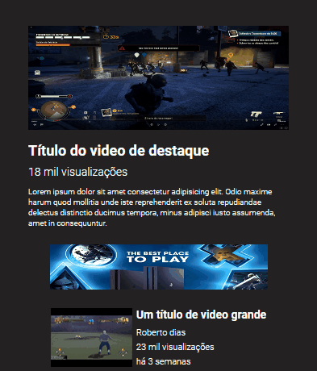

# Projeto Layout do Youtube

Projeto simples criado com o objetivo de praticar HTML e CSS.

## Desafio realizado nesse projeto:
Criar um site estilo YouTube usando as técnicas ensinadas nas aulas de flex e grid.
## Screenshot
### Desktop

### Mobile

## Tecnologias utilizadas:
 - HTML
 - CSS

## Links
 URL da página - [Layout do Youtube](https://alexjr53.github.io/Layout-do-Youtube/)

## Autor
Alexsandro rosa junior

 GitHub - [Alexjr53](https://github.com/Alexjr53)

