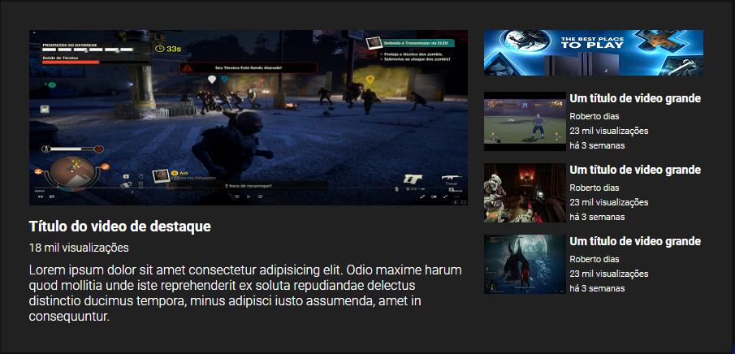

# Projeto HTML+CSS

## Um repositório com o intuito de praticar HTML e CSS.

[]

## Tecnologias utilizadas:
---
 

- HTML

- CSS

 

## Desafio realizado nesse projeto:
---
Criar um site estilo YouTube usando as técnicas ensinadas nas aulas de flex e grid.
